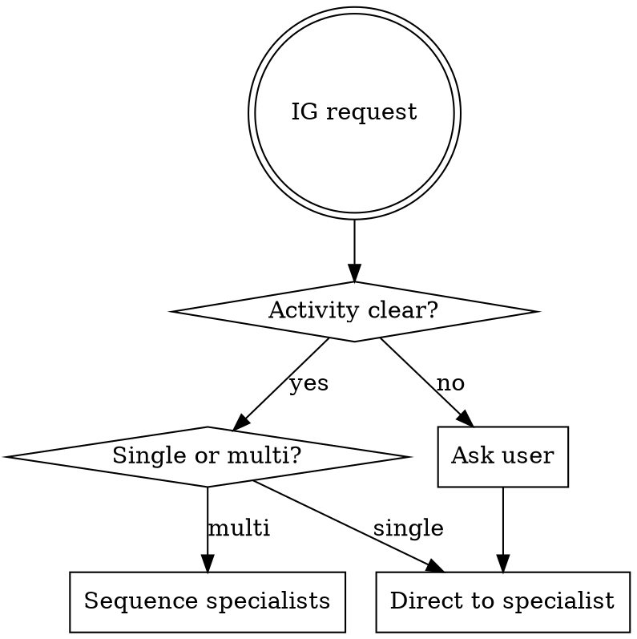

# IG Orchestrator

## Overview

Routes Instagram-related requests to the right specialist within the IG family. This skill does NOT implement IG content itself — it detects sub-intent and delegates.

**Philosophy:**

```
copywriting-orchestrator (top router for all copy)
        ↓ detects "instagram, ig, reel, story, post, social"
        
ig-orchestrator (this skill — IG family router)
        ↓ detects sub-intent
        ├── ig-content    (WRITING — captions, posts, carousels)
        ├── ig-strategy   (PLANNING — formats, production, engagement, monetizace)
        ├── (future) ig-reels      — Reels-specific writing + tactics
        ├── (future) ig-stories    — Stories-specific writing + tactics
        ├── (future) ig-carousel   — Carousels-specific
        ├── (future) ig-ads        — Paid IG campaigns
        └── (future) ig-analytics  — Performance analysis
```

**Announce:** "Using ig-orchestrator to route this Instagram request."

---

## When to Use

**USE this skill:**

- User says "ig" or "instagram" without specific intent
- Request spans multiple IG sub-domains (e.g., "naučit IG od nuly" = strategy + writing + production)
- Unclear whether user wants writing or planning
- Multi-step IG workflows (plan → write → adapt for Stories → caption Reels)

**DON'T use this skill:**

- Intent is clear → call specialist directly
  - "napiš IG post" → `ig-content` directly
  - "jaký formát Reelu" → `ig-strategy` directly
- Non-IG copy → use `copywriting-orchestrator` instead

---

## Sub-Intent Detection

### Step 1: Activity Detection

| User says... | Activity | Route to |
|---|---|---|
| `napiš`, `write`, `create caption`, `text pro post` | ✏️ Writing | **ig-content** |
| `carousel`, `slides`, `swipe post` | ✏️ Writing | **ig-content** |
| `Reel caption`, `text k videu` | ✏️ Writing | **ig-content** |
| `co točit`, `nápad na`, `jaký formát`, `idea` | 📋 Strategy | **ig-strategy** |
| `Reel vs Story`, `kdy postovat`, `engagement` | 📋 Strategy | **ig-strategy** |
| `iPhone setup`, `4K`, `nastavení kamery`, `shot list` | 🎥 Production | **ig-strategy** |
| `monetizace`, `brand deals`, `affiliate`, `media kit` | 💰 Monetization | **ig-strategy** |
| `výkon postu`, `analytika`, `co funguje` | 📊 Analytics | **ig-analytics** (future — fallback to ig-strategy for now) |

### Step 2: Multi-Domain Detection

If request spans multiple sub-domains, identify sequence:

```
"naučit IG od nuly"
  → ig-strategy (plán formátů + 4 kritéria nápadu)
  → ig-content (napsat první post)
  → ig-strategy (technical setup pro natáčení)

"product launch na IG"
  → ig-strategy (formát: post + Stories + Reel sekvence)
  → ig-content (napsat každý formát)
  → ig-strategy (engagement plán + hashtag mix)

"měsíční IG plán"
  → ig-strategy (calendar + 4 kritéria + série)
  → ig-content (jen pokud user chce hned napsat první)
```

### Step 3: Ask if Unclear

If neither activity nor multi-domain pattern matches, ask:

```
Co potřebuješ s Instagramem?

A) Napsat konkrétní post / caption / carousel  → ig-content
B) Naplánovat obsah / vybrat formát / strategie → ig-strategy
C) Technické nastavení natáčení (smartphone, světlo)  → ig-strategy
D) Engagement / community building  → ig-strategy
E) Monetizace / brand deals / affiliate  → ig-strategy
F) Vícekrokový workflow (plán + texty + produkce)  → multi-skill sequence
```

---

## Standard Workflow

### Phase 1: Detect Intent

Use the routing table above. If multi-domain → identify sequence.

### Phase 2: Briefing Check (Quick)

Before calling specialist, ensure brief minimum is clear:

- **KOMU (Audience):** Who is the IG audience? (B2C/B2B, language, niche)
- **KAM (Goal):** What action? (DM, follow, save, link click, share)
- **ČÍM (Differentiation):** What is the hook/angle?
- **PROČ (Why):** What context? (product launch, ongoing series, single post)

If briefing incomplete → prompt user before delegating.

### Phase 3: Call Specialist

Invoke the right sub-skill:

> "Using ig-content for IG post writing."
> "Using ig-strategy for content planning."

The specialist handles its own workflow (Otto principles for writing, format selection for strategy, etc.).

### Phase 4: Quality Gate

After specialist completes, verify against IG-level checks:

```
☐ Writing output uses code blocks (3-5 variants)?  [ig-content only]
☐ Zero framework labels in output (HOOK/SUBSTANCE/PAYOFF)?  [ig-content only]
☐ 3-5 relevant hashtags added?  [ig-content for posts]
☐ Posts vs Stories punctuation rules respected?  [ig-content]
☐ Strategy aligns with 4 idea criteria?  [ig-strategy]
☐ Format consistency (7-10 video rule)?  [ig-strategy]
```

---

## Multi-Skill Workflows

### Workflow 1: New IG content series (plan → write → produce)

```
1. ig-strategy → 4 kritéria nápadu, formát selection, série plán (10 nápadů)
2. ig-content → napsat 1-2 ukázkové posty
3. ig-strategy → technical setup pro natáčení
4. ig-strategy → engagement plán prvních 7 dní
```

### Workflow 2: Product launch campaign

```
1. ig-strategy → multi-format sekvence (Reel teaser → Post launch → Stories countdown → Carousel deep-dive)
2. ig-content → napsat každý formát s Otto principy
3. ig-strategy → hashtag strategy + posting times
4. ig-strategy → engagement tactics first 24h
```

### Workflow 3: Single post (most common)

```
1. ig-content (přímo, bez orchestratoru) → 3-5 variants → user vybírá → iterace
```

---

## Decision Logic



---

## Quick Reference

| Intent | Specialist |
|---|---|
| Writing IG copy | `ig-content` |
| Planning what/when/how | `ig-strategy` |
| Technical setup (camera, light) | `ig-strategy` |
| Engagement, community | `ig-strategy` |
| Monetization (brand deals, affiliate) | `ig-strategy` |
| Reels-specific tactics (future) | `ig-reels` (currently → ig-strategy) |
| Stories-specific tactics (future) | `ig-stories` (currently → ig-strategy) |
| IG Ads (future) | `ig-ads` (currently → ig-strategy) |
| Performance analysis (future) | `ig-analytics` (currently → ig-strategy) |

---

## Common Mistakes

**❌ Bypassing brief:**
"Let me just route..." → STOP. Confirm KOMU/KAM/ČÍM/PROČ first.

**❌ Wrong specialist:**
"Napiš caption k Reelu" → ig-content (NOT ig-strategy — strategy already done, this is pure writing)

**❌ Calling ig-orchestrator when intent is clear:**
"Napiš IG post" → ig-content directly. No need to route.

**❌ Forgetting multi-domain:**
"Product launch na IG" = sequence (strategy → content → strategy). Don't just call one.

---

## Related Skills

- **`ig-content`** — IG copywriting (Otto methodology, strict output discipline)
- **`ig-strategy`** — IG planning, formats, production, engagement, monetizace
- **`copywriting-orchestrator`** — top-level router for non-IG copy
- **`storytelling`** — generic narrative frameworks (used internally by ig-content)

**Future siblings (planned for Flatwhite + general use):**
- `ig-reels` — Reels writing + tactics (length, sound, transitions)
- `ig-stories` — Stories writing + interactive elements (polls, swipe-up)
- `ig-carousel` — Carousels writing + slide pacing
- `ig-ads` — Paid IG campaigns (Meta Ads Manager copy + targeting)
- `ig-analytics` — Performance analysis + iteration recommendations

---

**Philosophy:** Conductor doesn't play instruments. Orchestrator doesn't write copy.
