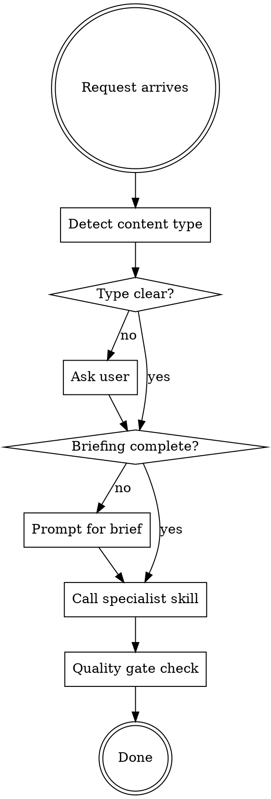

# Ottocopy - Copywriting Orchestrator

## Overview

This skill orchestrates copywriting work by detecting content type and calling the appropriate specialized skill. It does NOT implement copywriting itself - it routes to specialists.

**Philosophy:**
```
Orchestrator = Conductor
Specialized Skills = Musicians

The conductor doesn't play instruments, but coordinates who plays when.
```

**Announce:** "I'm using ottocopy to determine the right copywriting approach."

## When to Use

**USE this skill:**
- Any copywriting request (unclear which specialist to use)
- Multi-channel campaigns (product launch = product page + email + social)
- "Help me write copy for..." requests
- Content strategy requiring multiple formats

**DON'T use this skill:**
- Already know exact medium → use specialist directly
- Pure editing/proofreading (not copywriting)

## Content Type Detection

### Step 1: Keyword Detection

| Keywords in Request | Detected Type | Specialist Skill |
|---------------------|---------------|------------------|
| `instagram`, `reel`, `stories`, `post`, `social`, `tiktok` | Social Media | `ottocopy-instagram-content` |
| `homepage`, `web`, `landing`, `about us`, `sales page`, `website` | Web Copy | `ottocopy-web-copy` |
| `produkt`, `e-shop`, `product description`, `e-commerce`, `popis` | Product Copy | `ottocopy-product-copy` |
| `email`, `newsletter`, `mailing`, `campaign`, `sequence` | Email | `ottocopy-newsletter` |

### Step 2: Context Clues

If keywords unclear, check context:

```
Is it for social media platform?
├─ YES → ottocopy-instagram-content
│
Is it for a website page?
├─ YES → ottocopy-web-copy
│
Is it describing a product for sale?
├─ YES → ottocopy-product-copy
│
Is it sent to inbox?
├─ YES → ottocopy-newsletter
│
Still unclear?
└─ ASK user (see Step 3)
```

### Step 3: Ask if Unclear

```
I need to know what type of copy you're creating:

A) Instagram/Social Media (Reels, Stories, posts)
B) Website (homepage, landing page, about us)
C) Product Description (e-shop, e-commerce)
D) Email/Newsletter (campaigns, sequences)
E) Multi-channel campaign (combination)
```

## Skill Integration

### Skills this orchestrator calls:

```
ottocopy (orchestrator)
        │
        ├── ottocopy-instagram-content
        │   └── Hook-Substance-Payoff, viral content
        │
        ├── ottocopy-web-copy
        │   └── Blueprint, Triáda, PROTTO, homepage elements
        │
        ├── ottocopy-product-copy
        │   └── 7-step framework, Type A/B products
        │
        └── ottocopy-newsletter
            └── 9-step email anatomy, subject lines
```

### Shared Resources (loaded by specialists):

- `core-copywriting-principles.md` - 8 základních pravidel
- `core-briefing-process.md` - 8 otázek (CO, JAK, ČÍM, KDE, KOMU, KDO, KAM, PROČ)

## Standard Workflow

### Phase 1: Detection

Detect content type using keywords and context (see above).

### Phase 2: Briefing Check

Before calling specialist, ensure briefing is complete:

**Quick Brief (minimum 4 questions):**
- **KOMU (Audience):** Who is the target?
- **KAM (Goal):** What action do we want?
- **ČÍM (Differentiation):** Why us vs competitors?
- **PROČ (Why):** What's the deeper story?

If briefing incomplete → prompt user for answers before proceeding.

### Phase 3: Call Specialist

Invoke appropriate skill:
> "Using ottocopy-instagram-content for Instagram Reel creation."

The specialist skill handles its own workflow (TDD, checklists, quality controls).

### Phase 4: Quality Gate

After specialist completes, verify against Core Copywriting Principles:

```
☐ Headline bez tečky?
☐ Max 3 řádky na odstavec?
☐ Konkrétní čísla místo obecných tvrzení?
☐ Žádné zakázané klišé? (vysoká kvalita, flexibilní, komplexní...)
☐ Jasné CTA?
```

## Multi-Channel Campaigns

When request involves multiple channels:

### Example: Product Launch

```
User: "Chystám launch nového produktu"

Orchestrator detects: Multi-channel campaign

Recommended sequence:
1. ottocopy-product-copy → produktová stránka
2. ottocopy-newsletter → launch email sekvence
3. ottocopy-instagram-content → promo Reels/Stories

Execution: Call each skill in sequence OR parallel
```

### Example: Website Redesign

```
User: "Potřebujeme přepsat celý web"

Orchestrator detects: Web copy (multiple pages)

ottocopy-web-copy handles:
- Homepage (9 prvků)
- About Us
- Landing pages
- Blog structure
```

## Decision Logic



## Quick Reference

| Content Type | Specialist Skill | Core Framework |
|--------------|------------------|----------------|
| Instagram/Social | `ottocopy-instagram-content` | Hook-Substance-Payoff |
| Website/Landing | `ottocopy-web-copy` | Blueprint, Triáda, PROTTO |
| E-shop Products | `ottocopy-product-copy` | 7-step, Type A/B |
| Email/Newsletter | `ottocopy-newsletter` | 9-step anatomy |

## Common Mistakes

**❌ Bypassing briefing:**
"Let me just start writing..." → STOP. Brief first.

**❌ Using wrong specialist:**
Product description on landing page → `ottocopy-web-copy` (sales page section), NOT `ottocopy-product-copy`

**❌ Ignoring quality gate:**
Specialist done ≠ copy done. Always verify Core Principles.

**❌ Not detecting multi-channel:**
"Launch campaign" = multiple skills, not just one.

## Integration Notes

**From specialists back to orchestrator:**
If specialist needs input from another (e.g., UVP for web copy), orchestrator coordinates:
1. `uvp-optimization` → define positioning
2. `ottocopy-web-copy` → write homepage with UVP

**Cross-skill knowledge:**
- Instagram hooks can inform email subject lines
- Product copy microbenefits can become web headlines
- Newsletter CTAs follow same principles as web CTAs
