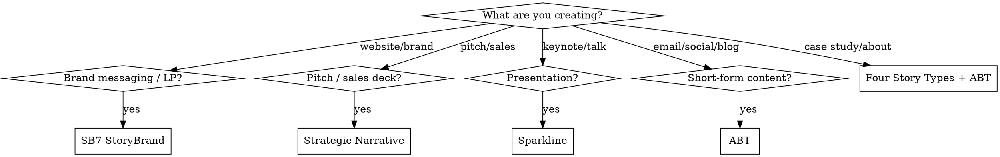

# Storytelling

## Overview

Every effective story has a **transformation moment** and **tension**. The audience is the hero, you are the guide.

**Core principle:** Stories work because they trigger oxytocin (trust, empathy) and neural coupling (listener's brain mirrors storyteller's brain). A story without conflict is just a report.

**Announce:** "I'm using storytelling to craft a narrative structure for this content."

## When to Use

**USE this skill:**

- Landing pages / product pages (story-driven structure)
- Pitch decks and investor presentations
- Brand messaging and About pages
- Sales emails and outreach sequences
- Case studies and customer stories
- Founder stories
- Content marketing (blog, newsletter, social)
- Any copy that feels flat, features-heavy, or unengaging

**DON'T use this skill:**

- Fiction writing or creative writing
- Pure technical documentation
- General copywriting routing (use `copywriting-orchestrator`)
- UVP definition (use `uvp-optimization`)

## Quick Router

| User says | Best framework |
|-----------|---------------|
| "Write a landing page" | SB7 StoryBrand |
| "Create a pitch deck" | Strategic Narrative |
| "Write a presentation" | Sparkline |
| "Tell our brand story" | SB7 StoryBrand + Founder Story |
| "Make this copy more compelling" | ABT + Storytelling Techniques |
| "Write a case study" | Customer Story (Four Story Types) |
| "Write a sales email" | ABT + Value Story |
| "Write an About page" | Founder Story + Purpose Story |
| "Blog post / newsletter" | ABT + SUCCESs |
| "Social media content" | ABT (shortest format) |

## Framework Selection



## Core Frameworks

### 1. ABT — And, But, Therefore

**The smallest storytelling unit.** Use everywhere as building block.

```
[Setup/context] AND [additional context]...
BUT [conflict/problem/tension]...
THEREFORE [resolution/action/CTA]
```

**Example (SaaS):**
```
Small businesses love connecting with customers AND social media makes it possible...
BUT managing 5 platforms while running a business is overwhelming...
THEREFORE Buffer lets you schedule everything from one dashboard in 10 minutes a day.
```

**Rules:**
- Never use "and then" — always causal ("but", "therefore", "because of that")
- The BUT is the most important part — no conflict = no story
- Works at paragraph level AND full-page level

### 2. SB7 StoryBrand (Donald Miller)

**Best for: brand messaging, landing pages, website copy.**

7 elements in order:

| # | Element | Question | Example |
|---|---------|----------|---------|
| 1 | **Hero** | Who is the customer? | "Busy founders who..." |
| 2 | **Problem** | External, internal, philosophical | External: no time. Internal: feels overwhelmed. Philosophical: shouldn't be this hard |
| 3 | **Guide** | How do you show empathy + authority? | "We've helped 10,000 founders..." |
| 4 | **Plan** | What are the 3 simple steps? | 1) Sign up, 2) Connect accounts, 3) Schedule |
| 5 | **Call to Action** | Direct + transitional CTA | "Start free trial" + "Watch demo" |
| 6 | **Failure** | What happens if they don't act? | "Keep losing 10hrs/week to social media chaos" |
| 7 | **Success** | What does transformation look like? | "Reclaim your evenings, grow 3x faster" |

**Critical rule:** Customer = Hero. Brand = Guide. Never make yourself the hero.

**Three layers of Problem:**
- **External** — tangible problem (no time to manage social media)
- **Internal** — how it makes them feel (overwhelmed, behind)
- **Philosophical** — why it's wrong (small businesses deserve growth too)

### 3. Strategic Narrative (Andy Raskin)

**Best for: pitch decks, investor presentations, sales decks.**

5 elements — never start with your product:

1. **Name a big shift** — "The old game is over" (industry change happening now)
2. **Show stakes** — Winners and losers in this new reality
3. **Paint the Promised Land** — Future state for those who adapt (not your product features)
4. **Introduce obstacles** — Why the Promised Land is hard to reach without help
5. **Present your solution** — NOW introduce your product as the path

**Example structure for a pitch deck:**
```
Slide 1-3:  "E-commerce changed. Customers expect personalization."
Slide 4-5:  "Companies that personalize grow 40% faster. Those that don't, die."
Slide 6-7:  "Imagine: every customer gets a unique experience, automatically."
Slide 8-9:  "But building personalization in-house takes 18 months and $2M."
Slide 10+:  "That's why we built [Product]. Personalization in 2 weeks."
```

### 4. Sparkline (Nancy Duarte)

**Best for: presentations, keynotes, long-form content.**

Alternate between "what is" (current reality) and "what could be" (better future):

```
What Is    →  What Could Be  →  What Is  →  What Could Be  →  NEW BLISS
(problem)     (possibility)    (deeper)    (bigger vision)    (call to action)
```

Each swing increases emotional intensity. End with irresistible "new bliss" — the transformed state.

**Used by:** Steve Jobs (iPhone launch), Martin Luther King Jr. ("I Have a Dream").

### 5. Four Story Types (Kindra Hall)

**Best for: business storytelling across contexts.**

| Story Type | Purpose | Use When |
|-----------|---------|----------|
| **Value Story** | Why should I buy? | Product pages, sales calls |
| **Founder Story** | Why should I trust you? | About page, investor pitch |
| **Purpose Story** | Why should I work here? | Hiring, culture pages |
| **Customer Story** | Social proof | Case studies, testimonials |

**Each story needs:** Identifiable character + authentic emotion + specific moment + detail

### 6. Five-Second Moment (Matthew Dicks)

**Best for: personal storytelling, founder stories, keynotes.**

Every story is about a **single moment of transformation** — the instant where the character changes. Everything in the story serves this moment.

**Rules:**
- **Start at the opposite** of where you end (sad → happy, lost → found)
- **Find the 5-second moment** — the specific instant of realization/change
- **Dinner Test** — would you tell this story to a stranger at dinner?
- **Homework for Life** — daily practice of capturing your story of the day

### 7. SUCCESs (Chip & Dan Heath)

**Best for: making any message memorable and shareable.**

| Principle | Meaning | Technique |
|-----------|---------|-----------|
| **S**imple | Core message, stripped down | Find the lead. One sentence. |
| **U**nexpected | Break patterns, surprise | Gap theory — open curiosity gaps |
| **C**oncrete | Specific, sensory details | "A man on the moon" not "space exploration goals" |
| **C**redible | Believable and trustworthy | Statistics, anti-authority, testable credentials |
| **E**motional | Make them feel something | Individual > statistics. Identity appeal. |
| **S**tories | Narrative structure | Challenge plot, connection plot, creativity plot |

## Storytelling Techniques

From Matthew Dicks — use these to enhance ANY framework:

| Technique | What it does | How |
|-----------|-------------|-----|
| **Elephant** | Hook attention in first 30 seconds | State the problem/mystery/stakes immediately |
| **Backpack** | Build anticipation before key moment | Load the audience with hopes and fears |
| **Hourglass** | Create tension at climax | Slow down time at the critical moment — detail every sensation |
| **But/Therefore** | Maintain causality | Never "and then" — always "but" or "because of that" or "therefore" |
| **Dinner Test** | Filter bad stories | "Would I tell this at dinner?" If no, don't write it. |
| **Begin at opposite** | Create transformation arc | Happy ending? Start sad. Success? Start with failure. |

## Neuroscience: Why Stories Work

- **Oxytocin** (Paul Zak): Emotional stories release oxytocin → trust, empathy, willingness to act. Character-driven narratives with tension work best.
- **Neural coupling** (Uri Hasson, Princeton): Listener's brain activity mirrors the storyteller's. Stories literally synchronize brains.
- **Cortisol + Dopamine**: Tension produces cortisol (attention). Resolution produces dopamine (reward). Together = engagement + memory.

**Implication:** Facts tell, stories sell. A story with data beats data alone every time.

## Standard Workflow

1. **Identify context** — What are you creating? (use Quick Router)
2. **Select framework** — Match to content type (use Framework Selection)
3. **Research the story elements** — Who is the hero? What's the conflict? What transforms?
4. **Draft using ABT** as backbone — Even within larger frameworks, each section should follow And-But-Therefore
5. **Apply techniques** — Elephant (hook), Hourglass (slow at climax), Begin at opposite
6. **SUCCESs check** — Is it Simple, Unexpected, Concrete, Credible, Emotional?
7. **Dinner Test** — Would you actually tell this story at dinner?

## Common Mistakes

- **No conflict** — Story without tension is a Wikipedia article. Always have a BUT.
- **Brand as hero** — Customer is ALWAYS the hero. Brand = guide/mentor (Yoda, not Luke).
- **Starting with product** — Start with the customer's world, their problem, the shift happening. Product comes last.
- **Too abstract** — "We help businesses grow" vs "Sarah was losing 3 customers a day until..."
- **No transformation** — Beginning and end should be different. Character must change.
- **Information dump** — Story is not a list of facts. Pick ONE moment, ONE transformation.
- **Skipping internal problem** — External problem gets attention. Internal problem (how it FEELS) drives action.
- **Generic opening** — "In today's fast-paced world..." is the kiss of death. Start with a specific, concrete moment.

## Related Skills

- `copywriting-orchestrator` — routes to the right copywriting specialist
- `web-copy` — landing page and website copy (apply storytelling frameworks here)
- `product-copy` — product descriptions and feature pages
- `uvp-optimization` — defining the value proposition (story wraps the UVP)
- `offer-creation` — creating compelling offers (story + offer = conversion)

## Resources

**Key books:** Storyworthy (Dicks), Building a StoryBrand (Miller), Stories That Stick (Hall), Resonate (Duarte), Made to Stick (Heath brothers), Wired for Story (Cron)

**Key people:** Matthew Dicks, Donald Miller, Nancy Duarte, Andy Raskin, Kindra Hall, Park Howell, Randy Olson

**NotebookLM:** Query `storytelling-research` notebook for deep dives on any framework.
