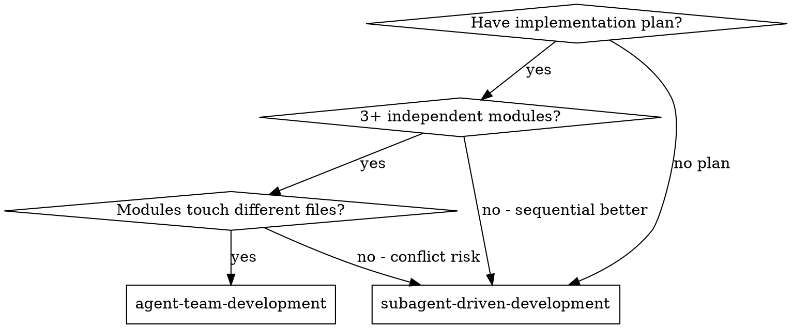
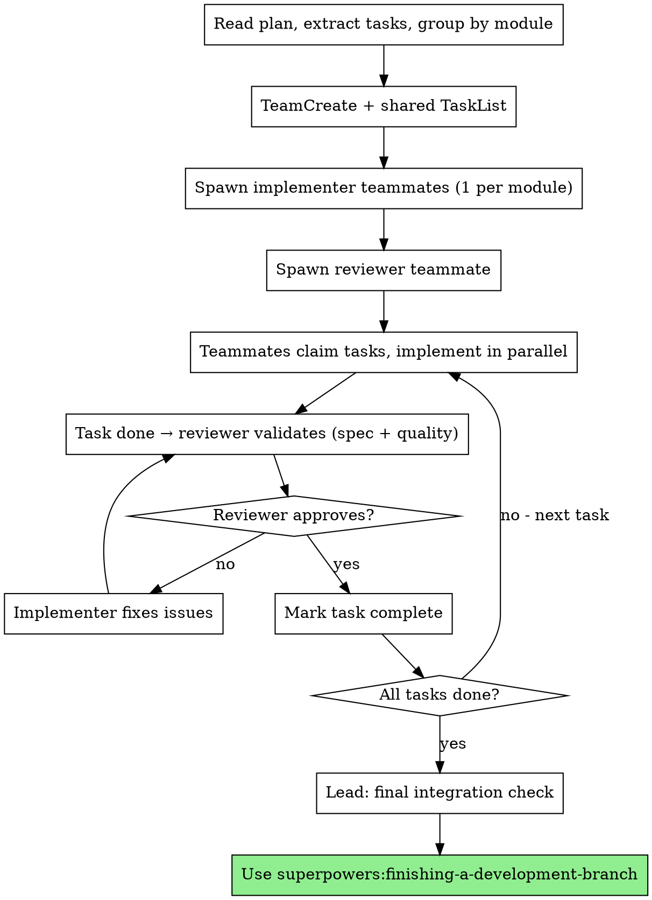

# Agent Team Development

Execute plan by spawning parallel teammates, each owning a module. Lead coordinates via shared task list. Review teammate validates quality continuously.

**Core principle:** Parallel teammates per module + persistent review teammate + shared task list = fast parallel execution with quality gates

**vs. Subagent-Driven (sequential):**
- Parallel execution (multiple tasks simultaneously)
- Teammates persist (shared context across tasks in their module)
- Teammates communicate directly (not just back to lead)
- Visible progress in tmux split panes

## When to Use



**Use when:**
- Plan has 3+ tasks that can run in parallel
- Tasks own separate files/directories (no overlap)
- Cross-layer work: API + frontend + tests simultaneously
- You want to see live progress in split panes

**Don't use when:**
- Tasks are sequential (each depends on previous)
- Tasks edit same files (teammates will overwrite each other)
- Simple feature (1-2 tasks) - overhead not worth it
- Tight token budget - each teammate is a separate Claude instance

## The Process



## Step-by-Step

### 1. Prepare Tasks

Read plan, extract all tasks. Group by module (file ownership):

```
Module A (src/api/):      Task 1, Task 4
Module B (src/components/): Task 2, Task 5
Module C (tests/):        Task 3, Task 6
```

**Rule:** No two modules may share files. If tasks overlap on files, keep them in same module (sequential within that teammate).

### 2. Create Team

```
TeamCreate:
  team_name: "feature-[name]"
  description: "Implementing [feature] with parallel teammates"
```

Then create shared tasks via TaskCreate for each task from the plan.

Set up dependencies with TaskUpdate if any task blocks another.

### 3. Spawn Teammates

**Implementer teammates** (1 per module, use Sonnet for cost efficiency):

```
Task tool:
  name: "impl-[module-name]"
  subagent_type: "general-purpose"
  team_name: "feature-[name]"
  model: "sonnet"
  prompt: |
    You are an implementer teammate responsible for [module name].

    ## Your Scope
    Files you own: [list of directories/files]
    DO NOT edit files outside your scope.

    ## How to Work
    1. Check TaskList for available tasks assigned to you
    2. Claim a task with TaskUpdate (set owner to your name)
    3. Implement following TDD (RED → GREEN → REFACTOR)
    4. Commit your work
    5. Message the reviewer: "Task N done, ready for review"
    6. Wait for reviewer feedback
    7. If issues found → fix and notify reviewer again
    8. When approved → mark task complete, claim next

    ## Communication
    - Message reviewer when task is ready for review
    - Message lead if blocked or if requirements are unclear
    - Message other implementers if you need something from their module

    ## Quality
    - Follow existing code patterns in the codebase
    - Write tests for everything you implement
    - Self-review before notifying reviewer
    - Don't overbuild - implement exactly what the task specifies
```

**Reviewer teammate** (1 per team):

```
Task tool:
  name: "reviewer"
  subagent_type: "general-purpose"
  team_name: "feature-[name]"
  model: "sonnet"
  prompt: |
    You are the review teammate. You validate every completed task.

    ## Your Job
    When an implementer messages you that a task is done:

    **Stage 1 - Spec Compliance:**
    - Read the task requirements from TaskGet
    - Read the actual code changes (git diff)
    - Verify: everything requested was built, nothing extra
    - If issues → message implementer with specific file:line references

    **Stage 2 - Code Quality (only after spec passes):**
    - Check: tests exist and pass, code is clean, follows patterns
    - Check: no security issues, no hardcoded values, proper error handling
    - If issues → message implementer with specifics

    **When both stages pass:**
    - Message implementer: "Approved"
    - Message lead: "Task N approved"

    ## Communication
    - Be specific in feedback (file:line, what's wrong, what to do)
    - Don't fix code yourself - tell the implementer what to fix
    - Message lead if you see cross-module issues or architecture concerns
```

### 4. Lead Coordination

While teammates work, the lead:

- **Monitors progress** via TaskList
- **Answers questions** from teammates
- **Resolves conflicts** if teammates need something from each other
- **Reassigns work** if a teammate gets stuck
- **Does NOT implement** - use delegate mode (Shift+Tab) to enforce this

### 5. Integration & Finish

When all tasks are complete and approved:

1. Lead runs full test suite to verify integration
2. Lead checks for any cross-module issues
3. Use `superpowers:finishing-a-development-branch` to complete

### 6. Cleanup

```
Send shutdown_request to each teammate
TeamDelete (after all teammates confirmed shutdown)
```

## Team Sizing

| Plan Size | Implementers | Reviewer | Total |
|-----------|:------------:|:--------:|:-----:|
| 3-5 tasks, 2 modules | 2 | 1 | 3 |
| 6-10 tasks, 3 modules | 3 | 1 | 4 |
| 10+ tasks, 4+ modules | 3-4 | 1 | 4-5 |

**Max 5 teammates.** More = diminishing returns, higher token cost, harder coordination.

Use Sonnet for teammates to manage costs. Lead (your session) runs on whatever model you chose.

## Common Mistakes

| Mistake | Fix |
|---------|-----|
| Teammates edit same files | Group tasks by file ownership before spawning |
| Lead starts implementing | Use delegate mode (Shift+Tab) |
| No reviewer teammate | Always spawn one - quality drops without review |
| Too many teammates | Max 5, prefer fewer with more tasks each |
| Forgetting cleanup | Always shutdown teammates + TeamDelete when done |
| Not setting task dependencies | Use TaskUpdate addBlockedBy before teammates start |
| Teammates waiting idle | Give each teammate 5-6 tasks, not just 1 |

## Integration

**Required workflow skills:**
- **superpowers:writing-plans** - Creates the plan this skill executes
- **superpowers:finishing-a-development-branch** - Complete development after all tasks

**Teammates should follow:**
- **superpowers:test-driven-development** - TDD for each task
- Project's CLAUDE.md conventions

**Alternative strategies:**
- **superpowers:subagent-driven-development** - Sequential, same session, lower token cost
- **superpowers:executing-plans** - Batch execution with human checkpoints
