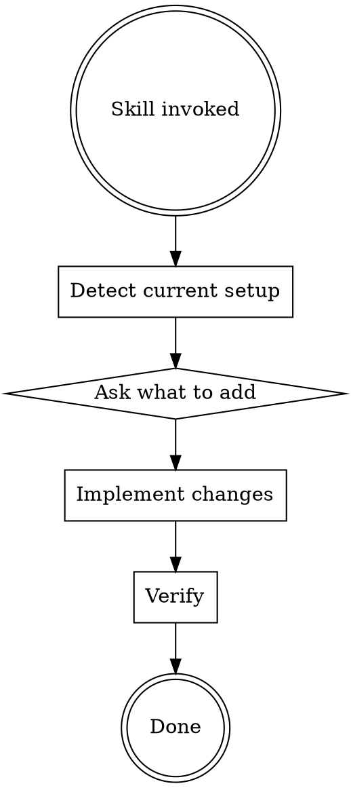

# Workflow Optimization Skill

## Overview

Optimalizuje Claude Code workflow kombinací Anthropic best practices (Cherny pattern) + Everything Claude Code patterns.

**Key improvements:**

- **mistakes.md** - Učení z chyb = 2-3x quality improvement
- **verification.md** - Built-in verification = 2-3x quality
- **ACTIVE_CONTEXT.md pruning** - Importance-based [MAJOR]/[MINOR] tagging
- **CHECKPOINTS.md update** - Mistakes detection rule
- **Code quality hooks** - Auto-format, TS check, console.log detection
- **Pattern learning** - /learn command + continuous-learning hook
- **Checkpoints** - /checkpoint command for workflow milestones
- **Build error resolver** - Dedicated agent for minimal-diff build fixes

**Announce:** "I'm using workflow-optimization to improve your Claude Code workflow."

## When to Use

**USE this skill:**

- "Optimize my Claude workflow"
- "Add mistakes tracking to this project"
- "Setup verification checklist"
- "Improve context management"
- After running `projectsetup` to add workflow improvements

**DON'T use this skill:**

- Project has no `.claude/` folder yet → run `projectsetup` first
- Just want to create CLAUDE.md → use `projectsetup`

## Workflow



### Step 1: Detect Current Setup

Check existing `.claude/` structure:

```bash
ls -la .claude/
```

| File              | Status  | Action                     |
| ----------------- | ------- | -------------------------- |
| CLAUDE.md         | Missing | Run `projectsetup` first   |
| .claude/          | Missing | Run `projectsetup` first   |
| mistakes.md       | Missing | Create from template       |
| verification.md   | Missing | Create project-specific    |
| ACTIVE_CONTEXT.md | >15KB   | Prune with [MAJOR]/[MINOR] |
| CHECKPOINTS.md    | Present | Add mistakes detection     |

### Step 2: Ask What to Add

**Question:** What optimizations do you want?

| Option                                 | What it adds                                                 |
| -------------------------------------- | ------------------------------------------------------------ |
| **A) Full optimization** (Recommended) | Everything below                                             |
| **B) Mistakes tracking only**          | .claude/mistakes.md + CHECKPOINTS update                     |
| **C) Verification checklist only**     | .claude/verification.md customized for project               |
| **D) Context pruning only**            | Update ACTIVE_CONTEXT.md format                              |
| **E) Code quality hooks**              | Auto-Prettier, TS check, console.log warning                 |
| **F) Pattern learning**                | /learn command + continuous-learning SessionEnd hook         |
| **G) Checkpoints**                     | /checkpoint command for workflow milestones                  |
| **H) Build error resolver**            | Agent for minimal-diff build/TS error fixes                  |
| **I) Project Summaries**               | ARCHITECTURE.md + module READMEs (Pyramid Summaries pattern) |
| **J) Stop Guard**                      | Plan-aware stop prevention hook                              |
| **K) Context Monitor**                 | Tool call count based context usage tracking                 |
| **L) TDD Enforcer**                    | Missing test file detection on Write/Edit                    |
| **M) Plan Lifecycle**                  | YAML frontmatter status in plan files                        |
| **N) Review Agents**                   | plan-challenger + compliance-reviewer + quality-reviewer     |
| **O) OS Notifications**                | macOS/Linux native notifications                             |

### Step 3: Implement Changes

Based on user choice, create/update files.

#### A) Full Optimization

1. Create `mistakes.md` from template
2. Create `verification.md` customized for detected stack
3. Add [MAJOR]/[MINOR] format to ACTIVE_CONTEXT.md
4. Create `archive/` folder for old sessions
5. Add mistakes detection rule to CHECKPOINTS.md
6. Setup hooks (see "Hook Setup" section below):
   - `~/.claude/hooks/after-commit.sh` - reflection reminder after commits
   - `~/.claude/hooks/load-mistakes.sh` - load lessons at session start
   - Update `~/.claude/settings.json` with PostToolUse + SessionStart hooks
7. **NEW:** Add code quality hooks (Option E)
8. **NEW:** Setup pattern learning (Option F)
9. **NEW:** Add checkpoint command (Option G)
10. **NEW:** Create build-error-resolver agent (Option H)
11. **NEW:** Add project summaries (Option I)

#### B) Mistakes Tracking Only

1. Create `mistakes.md` from template
2. Add mistakes detection rule to CHECKPOINTS.md

#### C) Verification Only

1. Detect project stack (FastAPI/Expo/Nette/etc.)
2. Create `verification.md` with stack-specific checks

#### D) Context Pruning Only

1. Read current ACTIVE_CONTEXT.md
2. Classify entries as [MAJOR] or [MINOR]
3. Keep all [MAJOR] + last 5 [MINOR]
4. Move older [MINOR] to archive/

#### E) Code Quality Hooks

Add to `~/.claude/settings.json` PostToolUse hooks:

1. **Auto-format with Prettier** after JS/TS edits
2. **TypeScript check** after .ts/.tsx edits
3. **console.log warning** after JS/TS edits

See "Code Quality Hooks" section below for implementation.

#### F) Pattern Learning

1. Create `/learn` command in `~/.claude/commands/learn.md`
2. Create `~/.claude/skills/learned/` directory
3. Add SessionEnd hook for continuous-learning

See "Pattern Learning" section below for implementation.

#### G) Checkpoints

1. Create `/checkpoint` command in `~/.claude/commands/checkpoint.md`
2. Create `.claude/checkpoints.log` for tracking

See "Checkpoints" section below for implementation.

#### H) Build Error Resolver

1. Create `~/.claude/agents/build-error-resolver.md`
2. Specialized agent for minimal-diff build/TS fixes

See "Build Error Resolver Agent" section below for implementation.

#### I) Project Summaries

1. Detect if project has existing source files (`src/`, `lib/`, `app/`, etc.)
2. If existing project (has source directories):
   - Auto-generate draft `ARCHITECTURE.md` by scanning directory structure, key config files, main entry points
   - Show to user: "Here's my draft ARCHITECTURE.md. Review and adjust?"
3. If new/empty project:
   - Create `ARCHITECTURE.md` template with sections to fill in later
   - Add reminder: "Update ARCHITECTURE.md after implementing first feature"
4. Recommend module `README.md` for directories with 5+ files
5. Add to `CHECKPOINTS.md`: "After adding new module → update ARCHITECTURE.md"

See "Project Summaries" section below for implementation.

### Step 4: Update Maturity & Verify

**Update Workflow Maturity table** in `.claude/ACTIVE_CONTEXT.md`:

- Set `workflow-optimization` to ✅
- If Pyramid Summaries added (Option I): set to ✅
- If Playwright scaffold exists: set `Scenario testing` to ✅
- Update level based on count of ✅ components (1=Basic, 2=Structured, 3=Optimized, 4=Automated, 5=Full)

**Verify:**

- [ ] New files created
- [ ] CHECKPOINTS.md updated (if applicable)
- [ ] ACTIVE_CONTEXT.md < 15KB (if pruned)
- [ ] Hooks executable (Full optimization only)
- [ ] settings.json has PostToolUse + SessionStart hooks (Full optimization only)
- [ ] Maturity table updated in ACTIVE_CONTEXT.md
- [ ] Format understood by user

## Templates

### mistakes.md Template

```markdown
# Mistakes Log

> Reaktivní poučení z chyb. Pro proaktivní architektonická rozhodnutí viz `DECISIONS.md`.
> **Účel:** Cherny pattern - učit se z chyb = 2-3x quality improvement

---

## Template

## [YYYY-MM-DD]: Krátký popis chyby

**Co se stalo:**
[Konkrétní chyba - co nefungovalo]

**Proč:**
[Root cause - proč k tomu došlo]

**Oprava:**
[Jak se to vyřešilo]

**Poučení:**
[Co dělat příště jinak - konkrétní pravidlo]

**Tags:** #backend #frontend #database #testing #deployment #security

---

## Logged Mistakes

(Empty - will be populated during development)

---

**Last Updated:** [DATE]
```

### verification.md Template (Stack-Specific)

Detect stack and generate relevant checklist:

| Stack   | Sections                                                                                        |
| ------- | ----------------------------------------------------------------------------------------------- |
| FastAPI | Tests (pytest, mypy), Security (input validation, tenant isolation), Database (N+1, migrations) |
| Expo    | Tests (npm test, tsc), UI/UX (iOS/Android test, dark mode), i18n                                |
| Nette   | Templates (Latte syntax), Assets (Vite build), Security (XSS)                                   |
| Generic | Tests, Type safety, Manual test, Security basics                                                |

### ACTIVE_CONTEXT.md Format

```markdown
# Aktuální stav práce

> **Format:** [MAJOR] = architektonická rozhodnutí, nové features, breaking changes. [MINOR] = bug fixes, refactoring.
> **Rule:** All [MAJOR] + last 5 [MINOR]. Older [MINOR] → `archive/minor-sessions.md`

---

## [MAJOR] 2026-01-05: Feature Name

- **Impact:** Why this is major
- **Files:** key files changed
- **Commit:** hash

## [MINOR] 2026-01-04: Bug Fix

- Brief description
- **File:** single file if relevant

---

## Klíčová rozhodnutí

| #   | Rozhodnutí | Důvod |
| --- | ---------- | ----- |
| 1   | Decision   | Why   |

---

**Last Updated:** [DATE]
**Archive:** Older [MINOR] sessions in `archive/minor-sessions.md`
```

### CHECKPOINTS.md Addition

Add to end of existing CHECKPOINTS.md:

```markdown
---

## Before Session End - Mistakes Detection

If during this session:

- I apologized for an error
- I had to revert/undo something
- I made multiple attempts at the same thing
- Tests failed and I had to fix my code

→ **PROPOSE entry for `.claude/mistakes.md`:**

## [YYYY-MM-DD]: Brief description

**Co se stalo:** [What went wrong]
**Proč:** [Root cause]
**Oprava:** [How it was fixed]
**Poučení:** [What to do differently next time]
**Tags:** #relevant #tags

**Why:** Learning from mistakes = 2-3x quality improvement (Cherny pattern)
```

## [MAJOR] vs [MINOR] Classification

### [MAJOR] - Keep All

- Architektonická rozhodnutí
- Nové features (ne bug fixes)
- Breaking changes
- Security fixes
- API changes
- UX pattern changes
- New integrations (Stripe, etc.)

### [MINOR] - Keep Last 5

- Bug fixes
- CSS/styling tweaks
- Refactoring (no behavior change)
- Config changes
- Cache issues
- Documentation updates

## Pruning Rules

1. **Importance over time:** [MAJOR] zůstává navždy, [MINOR] se archivuje
2. **Trigger:** Když ACTIVE_CONTEXT.md > 15KB, archivovat nejstarší [MINOR]
3. **Archive location:** `.claude/archive/minor-sessions.md`
4. **Format:** Condensed - jen key facts, ne full implementation details

## Common Mistakes

**❌ Archiving [MAJOR] entries:**
Never archive important decisions - they need to be visible.

**❌ Too much detail in [MINOR]:**
Keep [MINOR] entries brief - just enough to remember what happened.

**❌ Forgetting to update mistakes.md:**
CHECKPOINTS.md rule should remind Claude at session end.

**❌ Stack-generic verification:**
Always customize verification.md for the specific project stack.

## Hook Setup (Full Optimization)

Full optimization includes automatic hooks for mistakes tracking:

### 1. After-Commit Hook

**Purpose:** Triggers reflection reminder after every git commit - perfect moment for learning.

**File:** `~/.claude/hooks/after-commit.sh`

```bash
#!/bin/bash
INPUT=$(cat)
COMMAND=$(echo "$INPUT" | jq -r '.tool_input.command // empty')

if echo "$COMMAND" | grep -qE "git commit"; then
    cat << 'EOF'
{"systemMessage": "Commit complete.\n\n**Quick reflection:**\n- Did anything unexpected happen?\n- Did I retry/revert anything?\n- Any assumptions that were wrong?\n\nIf yes -> propose .claude/mistakes.md entry"}
EOF
else
    echo '{}'
fi
```

### 2. Load Mistakes Hook

**Purpose:** Loads lessons from mistakes.md at session start as context.

**File:** `~/.claude/hooks/load-mistakes.sh`

```bash
#!/bin/bash
if [ -f ".claude/mistakes.md" ]; then
    # Support both Czech (Poučení) and ASCII (Pouceni) variants
    LESSONS=$(grep -A2 "^\*\*Pou[čc]en[ií]:\*\*" .claude/mistakes.md 2>/dev/null | grep -v "^--$" | grep -v "^\*\*Pou[čc]en[ií]:\*\*" | sed '/^$/d')
    if [ -n "$LESSONS" ]; then
        ESCAPED=$(echo "$LESSONS" | jq -Rs .)
        echo "{\"systemMessage\": \"Lessons from mistakes.md:\\n${ESCAPED}\"}"
        exit 0
    fi
fi
echo '{}'
```

### 3. Settings.json Configuration

Add to `~/.claude/settings.json`:

```json
{
  "hooks": {
    "SessionStart": [
      {
        "matcher": "startup",
        "hooks": [
          {
            "type": "command",
            "command": "bash ~/.claude/hooks/load-mistakes.sh"
          }
        ]
      }
    ],
    "PostToolUse": [
      {
        "matcher": "Bash",
        "hooks": [
          {
            "type": "command",
            "command": "bash ~/.claude/hooks/after-commit.sh",
            "timeout": 5
          }
        ]
      }
    ]
  }
}
```

### Hook Installation

When implementing **Full optimization (Option A)**, create hooks:

```bash
# Create hooks
chmod +x ~/.claude/hooks/after-commit.sh
chmod +x ~/.claude/hooks/load-mistakes.sh

# Verify settings.json has PostToolUse + SessionStart hooks
```

## Integration with Other Skills

| Skill                  | Relationship                           |
| ---------------------- | -------------------------------------- |
| `projectsetup`         | Run first if no .claude/ exists        |
| `deep-review`          | Use verification.md checklist          |
| `systematic-debugging` | Log fixes to mistakes.md               |
| `development-workflow` | Follow verification.md before commits  |
| `build-error-resolver` | New agent for minimal-diff build fixes |

---

## Code Quality Hooks (Option E)

Automatic code quality checks after every edit.

| Hook                | Trigger               | What it does                 |
| ------------------- | --------------------- | ---------------------------- |
| Auto-Prettier       | Edit \*.ts/tsx/js/jsx | Formats code automatically   |
| TypeScript check    | Edit \*.ts/tsx        | Runs tsc --noEmit on file    |
| console.log warning | Edit \*.ts/tsx/js/jsx | Warns about debug statements |

### Implementation

Add to `~/.claude/settings.json` under `hooks.PostToolUse`:

**1. Auto-Prettier:**

```json
{
  "matcher": "tool == \"Edit\" && tool_input.file_path matches \"\\\\.(ts|tsx|js|jsx)$\"",
  "hooks": [
    {
      "type": "command",
      "command": "bash ~/.claude/hooks/auto-prettier.sh"
    }
  ],
  "description": "Auto-format JS/TS files with Prettier"
}
```

**File:** `~/.claude/hooks/auto-prettier.sh`

```bash
#!/bin/bash
INPUT=$(cat)
FILE=$(echo "$INPUT" | jq -r '.tool_input.file_path // empty')
if [ -n "$FILE" ] && [ -f "$FILE" ]; then
    npx prettier --write "$FILE" 2>/dev/null
fi
echo "$INPUT"
```

**2. TypeScript Check:**

```json
{
  "matcher": "tool == \"Edit\" && tool_input.file_path matches \"\\\\.(ts|tsx)$\"",
  "hooks": [
    {
      "type": "command",
      "command": "bash ~/.claude/hooks/ts-check.sh"
    }
  ],
  "description": "TypeScript check after editing .ts/.tsx"
}
```

**File:** `~/.claude/hooks/ts-check.sh`

```bash
#!/bin/bash
INPUT=$(cat)
FILE=$(echo "$INPUT" | jq -r '.tool_input.file_path // empty')
if [ -n "$FILE" ] && [ -f "$FILE" ]; then
    ERRORS=$(npx tsc --noEmit --pretty false 2>&1 | grep "$FILE" | head -10)
    if [ -n "$ERRORS" ]; then
        echo "$ERRORS" >&2
    fi
fi
echo "$INPUT"
```

**3. console.log Warning:**

```json
{
  "matcher": "tool == \"Edit\" && tool_input.file_path matches \"\\\\.(ts|tsx|js|jsx)$\"",
  "hooks": [
    {
      "type": "command",
      "command": "bash ~/.claude/hooks/console-log-check.sh"
    }
  ],
  "description": "Warn about console.log statements"
}
```

**File:** `~/.claude/hooks/console-log-check.sh`

```bash
#!/bin/bash
INPUT=$(cat)
FILE=$(echo "$INPUT" | jq -r '.tool_input.file_path // empty')
if [ -n "$FILE" ] && [ -f "$FILE" ]; then
    MATCHES=$(grep -n "console\.log" "$FILE" 2>/dev/null | head -5)
    if [ -n "$MATCHES" ]; then
        echo "[Hook] WARNING: console.log found in $FILE" >&2
        echo "$MATCHES" >&2
        echo "[Hook] Remove before committing" >&2
    fi
fi
echo "$INPUT"
```

---

## Pattern Learning (Option F)

Two-part system: manual /learn + automatic SessionEnd extraction.

### /learn Command

**File:** `~/.claude/commands/learn.md`

```markdown
# /learn - Extract Reusable Patterns

Analyze current session and extract patterns worth saving.

## What to Extract

1. **Error Resolution** - How specific errors were resolved
2. **Debugging Techniques** - Non-obvious approaches
3. **Workarounds** - Library/framework quirks
4. **Project Patterns** - Conventions discovered

## Process

1. Review session for extractable patterns
2. Draft skill file:

## [Pattern Name]

**Extracted:** [Date]
**Context:** [When this applies]

### Problem

[What problem this solves]

### Solution

[The technique/workaround]

### Example

[Code if applicable]

3. Ask user to confirm
4. Save to ~/.claude/skills/learned/[pattern-name].md

## Don't Extract

- Trivial fixes (typos, syntax)
- One-time issues (API outages)
- Config that won't repeat
```

### Continuous Learning Hook

**File:** `~/.claude/hooks/evaluate-session.sh`

```bash
#!/bin/bash
cat << 'EOF'
{"systemMessage": "Session ending.\n\n**Pattern check:**\n- Non-trivial problem solved?\n- Useful workaround discovered?\n- Debugging technique worth remembering?\n\nIf yes -> /learn or note for next session."}
EOF
```

Add to settings.json:

```json
{
  "hooks": {
    "SessionEnd": [
      {
        "matcher": "*",
        "hooks": [
          {
            "type": "command",
            "command": "bash ~/.claude/hooks/evaluate-session.sh"
          }
        ],
        "description": "Pattern extraction reminder"
      }
    ]
  }
}
```

### Setup

```bash
mkdir -p ~/.claude/skills/learned
mkdir -p ~/.claude/commands
# Copy learn.md to ~/.claude/commands/
```

---

## Checkpoints (Option G)

Simple milestone system for tracking workflow progress.

### /checkpoint Command

**File:** `~/.claude/commands/checkpoint.md`

```markdown
# /checkpoint - Workflow Milestones

## Usage

- /checkpoint create <name> - Create named checkpoint
- /checkpoint verify <name> - Compare to checkpoint
- /checkpoint list - Show all checkpoints

## Create Checkpoint

1. Verify clean state (tests pass)
2. Log to .claude/checkpoints.log:
   YYYY-MM-DD-HH:MM | name | git-sha
3. Report success

## Verify Checkpoint

1. Find checkpoint in log
2. Compare:
   - Files changed since
   - Test/build status
3. Report comparison

## Typical Flow

[Start] -> /checkpoint create "feature-start"
[Implement] -> /checkpoint create "core-done"
[Test] -> /checkpoint verify "core-done"
[PR] -> /checkpoint verify "feature-start"
```

### Implementation Script

**File:** `~/.claude/scripts/checkpoint.sh`

```bash
#!/bin/bash
ACTION=$1
NAME=$2
LOG=".claude/checkpoints.log"

case $ACTION in
    create)
        mkdir -p .claude
        TIMESTAMP=$(date +%Y-%m-%d-%H:%M)
        SHA=$(git rev-parse --short HEAD 2>/dev/null || echo "no-git")
        echo "$TIMESTAMP | $NAME | $SHA" >> "$LOG"
        echo "Checkpoint '$NAME' created at $SHA"
        ;;
    verify)
        ENTRY=$(grep "$NAME" "$LOG" | tail -1)
        SHA=$(echo "$ENTRY" | awk -F'|' '{print $3}' | tr -d ' ')
        echo "Changes since '$NAME' ($SHA):"
        git diff --stat "$SHA" HEAD 2>/dev/null || echo "Cannot diff"
        ;;
    list)
        cat "$LOG" 2>/dev/null || echo "No checkpoints"
        ;;
esac
```

---

## Build Error Resolver Agent (Option H)

Dedicated agent for fixing build/TypeScript errors with **minimal diffs**.

### Agent Definition

**File:** `~/.claude/agents/build-error-resolver.md`

```markdown
---
name: build-error-resolver
description: Fixes build/type errors with minimal diffs. No refactoring, no architecture changes.
tools: Read, Edit, Bash, Grep, Glob
model: sonnet
---

# Build Error Resolver

Fix TypeScript and build errors quickly with smallest possible changes.

## Rules

**DO:** Add types, null checks, fix imports, add dependencies
**DON'T:** Refactor, rename, add features, optimize

## Workflow

1. Collect errors: npx tsc --noEmit --pretty
2. Fix one at a time, smallest change
3. Verify after each fix
4. Report: errors fixed, lines changed, status

## Common Fixes

**Type inference:** Add `: Type` annotation
**Null/undefined:** Add `?.` or `?? default`
**Missing property:** Add to interface
**Import error:** Fix path or install package

## Success Criteria

- tsc --noEmit exits 0
- npm run build passes
- < 5% lines changed per file
- No new errors
```

### When to Use

- `npm run build` fails
- `npx tsc --noEmit` shows errors
- Type errors blocking development

### Invocation

Claude automatically uses when detecting build failures, or manually:

```
Use build-error-resolver agent to fix these errors
```

---

## Project Summaries (Option I)

Pyramid Summaries pattern: 3-layer documentation so agents don't waste tokens reading entire codebases.

```
Level 1: ARCHITECTURE.md (1 page max, project root)
  - Overview of modules, main dependencies, data flow
  - Agent reads this ALWAYS as the first thing at session start

Level 2: module/README.md (per module/directory)
  - Public API, main classes/functions, dependencies on other modules
  - Agent reads when it needs to work within that module

Level 3: Source code
  - Agent reads only the specific files it needs
```

### Implementation

**1. Detect project type:**

```bash
# Check for existing source directories
ls -d src/ lib/ app/ packages/ modules/ 2>/dev/null
```

**2. For existing projects (has source directories):**

Generate draft `ARCHITECTURE.md` by scanning:

- Directory structure (`find . -type d -maxdepth 2`)
- Config files (package.json, tsconfig.json, etc.)
- Main entry points (index.ts, main.py, app.ts, etc.)
- Key dependencies from package manager files

Draft template for existing projects:

```markdown
# Architecture Overview

## Modules

| Module    | Purpose    | Key Files      |
| --------- | ---------- | -------------- |
| [scanned] | [inferred] | [entry points] |

## Dependencies

[Key external dependencies from package.json/requirements.txt]

## Data Flow

[Inferred from imports and config]

## Entry Points

- [main files found]

---

_Auto-generated by workflow-optimization. Review and adjust._
```

Show to user: "Here's my draft ARCHITECTURE.md. Review and adjust?"

**3. For new/empty projects:**

Create template:

```markdown
# Architecture Overview

> Fill in as the project grows. Keep under 1 page.

## Modules

| Module | Purpose | Key Files |
| ------ | ------- | --------- |
|        |         |           |

## Dependencies

[List key external dependencies]

## Data Flow

[Describe how data moves through the system]

## Entry Points

- [Main entry point]

---

_Reminder: Update this file after implementing first feature._
```

**4. Module READMEs:**

For directories with 5+ files, recommend creating `README.md`:

```markdown
# [Module Name]

## Purpose

[What this module does]

## Public API

- `functionName()` - [description]
- `ClassName` - [description]

## Dependencies

- [other modules this depends on]

## Usage

[Brief example]
```

**5. CHECKPOINTS.md addition:**

Add to existing CHECKPOINTS.md:

```markdown
## After Adding New Module

If a new module/directory was created:
→ Update ARCHITECTURE.md with new module entry
→ Create module README.md if directory will have 5+ files
```

### Integration

| Skill                  | Relationship                                 |
| ---------------------- | -------------------------------------------- |
| `projectsetup`         | Creates initial ARCHITECTURE.md template     |
| `development-workflow` | Phase 0 reads ARCHITECTURE.md first          |
| `session-context`      | ARCHITECTURE.md provides orientation context |

---

## Enforcement Hooks (Options J-O)

Claude-pilot inspired hooks for automated workflow enforcement. Added 2026-02-14.

### J) Stop Guard

Plan-aware stop prevention. Modifies `~/.claude/hooks/stop-verify.sh`:

- Before verification, checks for active plan with `in_progress` or `pending` status
- If found: blocks stop, shows plan name + progress + next task
- Escape hatch: second /stop within 60s forces approval
- Sources `~/.claude/hooks/plan-utils.sh` for shared plan utilities

### K) Context Monitor

Tool call heuristic for context usage. Creates `~/.claude/hooks/context-monitor.sh`:

- Tracks tool call count in `/tmp/claude-context-counter`
- Thresholds: 120 (info), 170 (save context), 220 (critical)
- Throttled: checks every 10 calls after 100
- Registered on Bash, Edit, Write PostToolUse matchers

### L) TDD Enforcer

Missing test file detection. Creates `~/.claude/hooks/tdd-enforcer.sh`:

- After Write/Edit of implementation file, checks for corresponding test file
- Supports: Python, TypeScript, JavaScript, Dart, PHP, Go
- Non-blocking: systemMessage reminder only
- Session dedup: warns once per file per session

### M) Plan Lifecycle

YAML frontmatter for plan files:

```yaml
---
status: pending | in_progress | complete | verified
created: YYYY-MM-DD
tasks_total: N
tasks_done: N
---
```

- `writing-plans` adds frontmatter at creation
- `executing-plans` updates after each task
- Stop guard and drift detection read status

### N) Review Agents

Three agents for structured review:

- `~/.claude/agents/plan-challenger.md` — adversarial plan review (before implementation)
- `~/.claude/agents/compliance-reviewer.md` — code vs plan compliance (after implementation)
- `~/.claude/agents/quality-reviewer.md` — code quality + TDD (after implementation)

### O) OS Notifications

macOS/Linux native notifications. Creates `~/.claude/hooks/notify.sh`:

- macOS: osascript with Glass sound
- Linux: notify-send with paplay
- Triggered at session end and after stop verification approval
