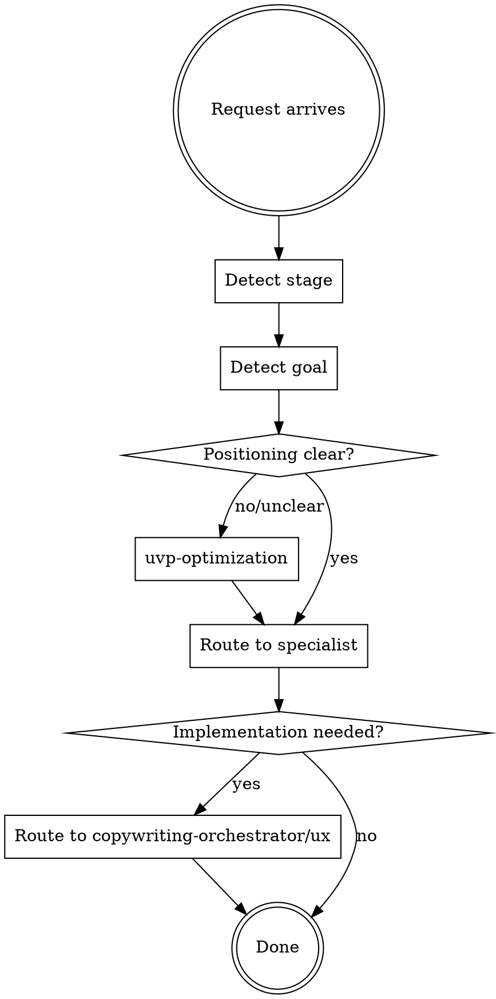

# Marketing Orchestrator

## Overview

This skill orchestrates marketing and growth work by detecting business stage, goal type, and routing to appropriate specialized skills. It does NOT implement strategies itself - it routes to specialists.

**Philosophy:**

```
Orchestrator = Conductor
Specialized Skills = Musicians

The conductor coordinates who plays when.
```

**Announce:** "I'm using marketing-orchestrator to determine the right marketing approach."

## When to Use

**USE this skill:**

- Marketing strategy requests
- "How do I get first customers?"
- Go-to-market planning
- Growth strategy for SaaS
- Launch planning
- "Help me grow my product"

**DON'T use this skill:**

- Already know exact need → use specialist directly
- Just copywriting → `copywriting-orchestrator`
- Just UX improvement → `ux-orchestrator`
- Just positioning → `uvp-optimization`

## Business Stage Detection

### Step 1: Stage Detection

| Indicators                    | Stage                 | Primary Focus           |
| ----------------------------- | --------------------- | ----------------------- |
| No customers, pre-launch      | **Stage 0: Idea**     | Validation, positioning |
| 0-10 customers, just launched | **Stage 1: Traction** | First customers, PMF    |
| 10-100 customers, growing     | **Stage 2: Growth**   | Scalable channels       |
| 100+ customers, optimizing    | **Stage 3: Scale**    | Optimization, expansion |

### Step 2: Goal Detection

| Keywords in Request                           | Detected Goal | Primary Skill                          |
| --------------------------------------------- | ------------- | -------------------------------------- |
| `first customers`, `launch`, `validate`       | Traction      | `offer-creation`, `growth-hacking`     |
| `positioning`, `differentiation`, `stand out` | Positioning   | `uvp-optimization`                     |
| `growth`, `scale`, `more customers`           | Growth        | `growth-hacking`, `product-led-growth` |
| `pricing`, `monetization`, `revenue`          | Monetization  | `pricing`, `offer-creation`            |
| `onboarding`, `activation`, `retention`       | PLG           | `product-led-growth`                   |
| `bootstrap`, `solo founder`, `limited budget` | Bootstrap     | `saas-bootstrap`                       |

### Step 3: Ask if Unclear

```
I need to understand your situation:

A) Pre-launch (validating idea, no customers yet)
B) Early stage (0-10 customers, finding product-market fit)
C) Growth stage (10-100 customers, looking to scale)
D) Optimization (100+ customers, improving metrics)

What's your current stage?
```

## Skill Integration

### Skills this orchestrator calls:

```
marketing-orchestrator
        │
        ├── offer-creation
        │   └── Grand Slam Offer, Value Equation, M-A-G-I-C
        │   └── Source: $100M Offers (Alex Hormozi)
        │
        ├── growth-hacking
        │   └── Growth Process, ICE Scoring, Must-Have Survey
        │   └── Source: Hacking Growth (Sean Ellis)
        │
        ├── product-led-growth
        │   └── Bowling Alley, MOAT Framework
        │   └── Source: Product-Led Growth (Wes Bush)
        │
        ├── saas-bootstrap
        │   └── Stair Step Method, 3 High/3 Low Metrics
        │   └── Source: The SaaS Playbook (Rob Walling)
        │
        └── uvp-optimization (existing)
            └── 10-Step Positioning Process
            └── Source: Obviously Awesome (April Dunford)
```

### Cross-skill from copywriting-orchestrator:

```
For implementation:
├── web-copy → Landing pages, sales pages
├── product-copy → Product descriptions
└── newsletter → Email sequences
```

## Standard Workflow

### Phase 1: Detection

Detect stage and goal using indicators above.

### Phase 2: Prerequisite Check

**Positioning is foundational.** If customers don't understand what you do, nothing else works.

```
Is positioning clear?
├─ NO → Start with uvp-optimization
├─ YES → Proceed to detected specialist
│
Is offer compelling?
├─ NO → offer-creation before growth-hacking
├─ YES → Proceed
```

### Phase 3: Route to Specialist

Based on detection, call appropriate skill:

> "Using growth-hacking for systematic experiment process."

### Phase 4: Implementation Handoff

After strategy defined, route to implementation skills:

- Copy needed → `copywriting-orchestrator`
- UX needed → `ux-orchestrator`
- Technical → `development-workflow`

## Stage-Specific Playbooks

### Stage 0: Idea Validation

```
Sequence:
1. uvp-optimization → Define positioning
2. offer-creation → Create compelling offer
3. growth-hacking (Must-Have Survey) → Validate PMF
```

### Stage 1: First Customers (0-10)

```
Sequence:
1. offer-creation → Grand Slam Offer
2. growth-hacking → ICE prioritization of channels
3. web-copy → Landing page
```

### Stage 2: Growth (10-100)

```
Sequence:
1. growth-hacking → Full growth process
2. product-led-growth → Optimize onboarding
3. saas-bootstrap → Monitor 3H/3L metrics
```

### Stage 3: Scale (100+)

```
Sequence:
1. product-led-growth → MOAT optimization
2. growth-hacking → Advanced experiments
3. pricing → Monetization optimization
```

## Decision Logic



## Quick Reference

| Problem Type               | Specialist Skill     | Core Framework                   |
| -------------------------- | -------------------- | -------------------------------- |
| Can't articulate value     | `uvp-optimization`   | 10-Step Positioning              |
| Offer not compelling       | `offer-creation`     | Grand Slam Offer, Value Equation |
| Need systematic growth     | `growth-hacking`     | Growth Process, ICE Scoring      |
| Product should sell itself | `product-led-growth` | Bowling Alley, MOAT              |
| Bootstrap SaaS             | `saas-bootstrap`     | Stair Step, 3H/3L Metrics        |

## Iron Laws

**From offer-creation:**

```
VALUE = (Dream Outcome × Perceived Likelihood) / (Time Delay × Effort)
If value isn't obvious, increase top or decrease bottom.
```

**From growth-hacking:**

```
NO GROWTH WITHOUT PRODUCT-MARKET FIT FIRST
40% "very disappointed" = PMF achieved
```

**From product-led-growth:**

```
TIME-TO-VALUE IS EVERYTHING
Reduce steps between signup and "Aha!" moment.
```

**From saas-bootstrap:**

```
STAIR STEP > MOONSHOT
Build skills and capital with simple products before complex SaaS.
```

## Common Mistakes

**Skipping positioning:**
"Let's run ads" when customers don't understand what you do → UVP first.

**Optimizing before PMF:**
"Let's A/B test the pricing" with 5 customers → Get to 40% PMF first.

**Building before validating:**
"Let me code this feature" → Validate demand first (offer-creation).

**Random growth tactics:**
"Let's try TikTok" → Use ICE scoring to prioritize systematically.

## Integration with Copywriting

After marketing strategy is defined:

| Strategy Output     | Copywriting Skill                 |
| ------------------- | --------------------------------- |
| UVP defined         | `web-copy` for homepage           |
| Offer created       | `web-copy` for sales page         |
| Lead magnet defined | `newsletter` for nurture sequence |
| Product positioning | `product-copy` for e-shop         |

## Example Scenarios

### Scenario 1: "Mám SaaS nápad, jak získat první zákazníky?"

```
Stage detected: 0-1 (Idea/Early)
Goal detected: First customers

Sequence:
1. uvp-optimization → "Who is this for? What makes it unique?"
2. offer-creation → "What's the Grand Slam Offer?"
3. growth-hacking → "Which channel to prioritize?" (ICE)
4. web-copy → Implementation
```

### Scenario 2: "Máme 50 uživatelů, jak růst rychleji?"

```
Stage detected: 2 (Growth)
Goal detected: Scale

First check: "Do you have PMF?" (Must-Have Survey)
├─ YES → growth-hacking full process
├─ NO → Focus on value before growth

Then: product-led-growth for onboarding optimization
```

### Scenario 3: "Chci spustit B2B SaaS jako solo founder"

```
Stage detected: 0-1 (Bootstrap)
Goal detected: Bootstrap launch

Sequence:
1. saas-bootstrap → Consider Stair Step approach
2. uvp-optimization → Positioning for niche
3. offer-creation → Compelling first offer
4. growth-hacking → ICE for channel selection
```

## Metrics for Success

| Skill                | Success Metric                             |
| -------------------- | ------------------------------------------ |
| `uvp-optimization`   | 80%+ clarity on five-second test           |
| `offer-creation`     | Conversion rate increase, price elasticity |
| `growth-hacking`     | Validated experiments, metric improvement  |
| `product-led-growth` | Time-to-value reduction, activation rate   |
| `saas-bootstrap`     | MRR growth, healthy 3H/3L ratios           |
