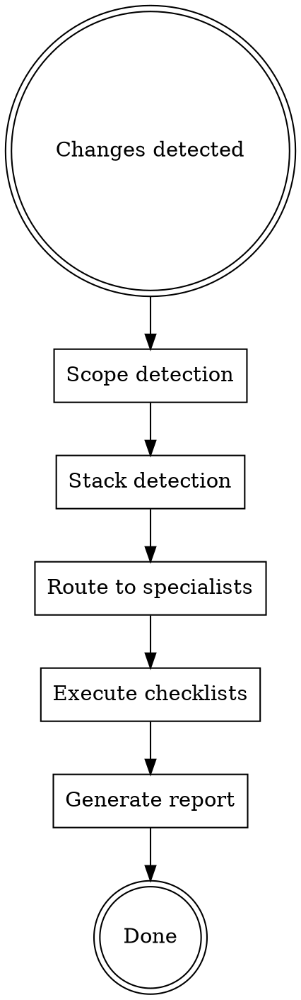

# Deep Review - Code Review Orchestrator

## Overview

This skill orchestrates comprehensive code review by auto-detecting stack and routing to specialized review skills. It does NOT implement reviews itself - it coordinates specialists.

**Philosophy:**

```
Orchestrator = Conductor
Specialized Skills = Musicians

The conductor coordinates, musicians play.
```

**Announce:** "I'm using deep-review to analyze your code changes."

## When to Use

**USE this skill:**

- After completing larger piece of work
- Before deploy to production
- When `/deep-review` command issued
- "Udělej hloubkovou analýzu"
- Code audit requested

**DON'T use this skill:**

- Quick spot check (use specialist directly)
- Just security review → `security-review`
- Just database review → `database-review`

## Workflow



### Step 1: Scope Detection

**If no argument:**

```bash
git diff --name-only  # Changed files
```

**If argument provided:**
| Argument | Scope |
|----------|-------|
| `backend`, `api` | Server-side focus |
| `frontend`, `ui` | Client-side focus |
| `security` | Security-only review |
| `database`, `db` | Database-only review |
| `/path/to/file` | Specific path only |

### Step 2: Stack Detection

| Indicator                            | Detected Stack  |
| ------------------------------------ | --------------- |
| `pyproject.toml`, `requirements.txt` | Python          |
| `FastAPI` imports                    | FastAPI         |
| `composer.json`, `.neon`             | PHP/Nette       |
| `package.json` + React/Vue           | Frontend        |
| `.latte` files                       | Nette templates |
| `checkout`, `cart`, `product`        | E-commerce      |
| REST endpoints                       | API             |
| SQL files, migrations                | Database        |

### Step 3: Route to Specialists

**Technical specialists:**

| Detected Stack   | Skills to Invoke                                         |
| ---------------- | -------------------------------------------------------- |
| Python/FastAPI   | `fastapi-workflow`, `security-review`, `database-review` |
| PHP/Nette        | `nette-framework`, `security-review`                     |
| Frontend         | `frontend-workflow`, `ux-optimization`                   |
| E-commerce       | `ux-optimization` (e-commerce practices)                 |
| API endpoints    | `api-design-review`, `security-review`                   |
| Database changes | `database-review`                                        |
| Any code         | `security-review` (always)                               |

**Perspective checks (auto-detected):**

| Scope Signal                                                         | Perspective              | What It Checks                                            |
| -------------------------------------------------------------------- | ------------------------ | --------------------------------------------------------- |
| UI/frontend files changed (`.tsx`, `.vue`, `.latte`, templates, CSS) | **UX Perspective**       | Usability, flow clarity, error states, accessibility      |
| New feature (not a fix/refactor)                                     | **Business Perspective** | Does it solve a real problem? Is scope right? Edge cases? |

These run IN ADDITION to technical specialists, in parallel.

### Step 4: Execute Checklists

For each invoked skill, run its checklist and record findings.

**Priority order:**

1. **CRITICAL** - Security vulnerabilities, data loss risks
2. **HIGH** - Performance issues, missing validation
3. **MEDIUM** - Code quality, missing tests
4. **LOW** - Style, documentation

### Step 5: Generate Report

```markdown
## Deep Review: [scope]

**Stack:** [detected]
**Files:** [count] analyzed
**Skills used:** [list]

---

### 🔴 CRITICAL (blocks deploy)

| File:line      | Issue         | Fix                     |
| -------------- | ------------- | ----------------------- |
| api/auth.py:45 | SQL injection | Use parameterized query |

---

### 🟠 HIGH (technical debt)

| File:line | Issue | Recommendation |
| --------- | ----- | -------------- |
| ...       | ...   | ...            |

---

### 🟡 MEDIUM (improvements)

- [ ] ...

---

### ⚪ LOW (nice to have)

- [ ] ...

---

### Checklist Summary

| Skill                | Issues Found | Critical | High |
| -------------------- | ------------ | -------- | ---- |
| security-review      | 3            | 1        | 2    |
| database-review      | 2            | 0        | 1    |
| api-design-review    | 1            | 0        | 0    |
| ux-perspective       | 1            | 0        | 1    |
| business-perspective | 0            | 0        | 0    |
```

## Specialist Skills

### Security Review (`security-review`)

- OWASP Top 10 checklist
- SQL injection, XSS, CSRF
- Auth/session handling
- Sensitive data exposure

### Database Review (`database-review`)

- N+1 queries
- Missing indexes
- Transaction handling
- Connection pooling

### API Design Review (`api-design-review`)

- REST conventions
- Error handling
- Pagination
- Rate limiting
- Versioning

### Framework-Specific

- `fastapi-workflow` - FastAPI patterns
- `nette-framework` - Nette patterns
- `frontend-workflow` - Frontend patterns

### UX Review

- `ux-optimization` - For frontend/e-commerce

### UX Perspective (inline - auto-triggered when UI files change)

**Trigger:** Changes include `.tsx`, `.vue`, `.latte`, template files, CSS/Tailwind, or components.

**Review questions (answer each with finding or "OK"):**

1. **Flow clarity:** Can a new user complete the task without confusion? Where might they get stuck?
2. **Error states:** What happens when things go wrong? Are error messages helpful and actionable?
3. **Loading states:** Are there loading indicators? What does the user see during async operations?
4. **Empty states:** What does the user see when there's no data? Is it helpful (not just blank)?
5. **Accessibility basics:** Keyboard navigation? Color contrast? Screen reader labels?
6. **Mobile:** Does it work on mobile? Touch targets large enough?

**Output format:**

```
### UX Perspective

| Area | Status | Finding |
|------|--------|---------|
| Flow clarity | OK / Issue | ... |
| Error states | OK / Issue | ... |
| Loading states | OK / Issue | ... |
| Empty states | OK / Issue | ... |
| Accessibility | OK / Issue | ... |
| Mobile | OK / Issue | ... |
```

### Business Perspective (inline - auto-triggered for new features)

**Trigger:** Change is a new feature (not a bug fix, refactor, or config change). Detected from branch name (`feature/`), commit messages, or plan context.

**Review questions (answer each with finding or "OK"):**

1. **Problem-solution fit:** Does this solve a real user problem? Can you articulate the problem in one sentence?
2. **Scope check:** Is the scope right? Too much (over-engineering) or too little (half-baked)?
3. **Edge cases:** What happens with 0 items? 1000 items? Concurrent users? Missing permissions?
4. **User impact:** Who benefits? How many users? How often?
5. **Reversibility:** Can this be easily changed/removed if it doesn't work out?

**Output format:**

```
### Business Perspective

| Area | Status | Finding |
|------|--------|---------|
| Problem-solution fit | OK / Issue | ... |
| Scope check | OK / Issue | ... |
| Edge cases | OK / Issue | ... |
| User impact | OK / Issue | ... |
| Reversibility | OK / Issue | ... |
```

## Red Flags - Stop Review, Alert Immediately

These require IMMEDIATE attention:

```
🚨 CRITICAL SECURITY ISSUES:
- Hardcoded secrets/credentials
- SQL injection vulnerabilities
- No auth on sensitive endpoints
- Plaintext passwords
- Debug mode in production
```

**Action:** Stop review, alert user, fix before continuing.

## Quick Reference

| Review Type          | Specialist Skill    | Focus                            |
| -------------------- | ------------------- | -------------------------------- |
| Security             | `security-review`   | OWASP Top 10                     |
| Database             | `database-review`   | N+1, indexes, transactions       |
| API                  | `api-design-review` | REST, errors, pagination         |
| FastAPI              | `fastapi-workflow`  | Pydantic, async, DI              |
| Nette                | `nette-framework`   | DI, Latte, Tracy                 |
| Frontend             | `frontend-workflow` | Components, state                |
| UX                   | `ux-optimization`   | Forms, e-commerce                |
| UX Perspective       | inline (auto)       | Flow, errors, empty states, a11y |
| Business Perspective | inline (auto)       | Problem fit, scope, edge cases   |

## Common Mistakes

**❌ Skipping security review:**
"It's just internal API" → Security review ALWAYS runs.

**❌ Ignoring low severity:**
Low ≠ unimportant. Track for later cleanup.

**❌ Not prioritizing:**
Fix CRITICAL before touching MEDIUM issues.

**❌ Missing stack detection:**
Check multiple indicators, not just one file.

## Integration Notes

**Triggering deep-review:**

- Manual: `/deep-review` or "review my changes"
- After significant code completion
- Before merge/deploy

**After review:**

- Fix CRITICAL immediately
- Create tickets for HIGH/MEDIUM
- Track LOW in tech debt backlog
