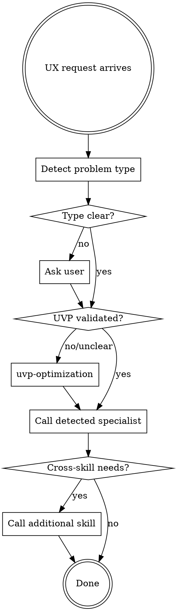

# UX Orchestrator

## Overview

This skill orchestrates UX work by detecting problem type and routing to the appropriate specialized skill. It does NOT implement UX solutions itself - it routes to specialists.

**Philosophy:**

```
Orchestrator = Conductor
Specialized Skills = Musicians

The conductor coordinates who plays when.
```

**Announce:** "I'm using ux-orchestrator to determine the right UX approach."

## When to Use

**USE this skill:**

- Any UX improvement request (unclear which specialist)
- "Make it better" / "Improve conversion" requests
- New website/landing page projects
- UX audit requests
- Multi-aspect UX work

**DON'T use this skill:**

- Already know exact need → use specialist directly
- Just A/B testing → `ux-optimization`
- Just expert critique → `ux-expert-dialogue`
- Just positioning → `uvp-optimization`

## Problem Type Detection

### Step 1: Keyword Detection

| Keywords in Request                                                   | Detected Type   | Specialist Skill     |
| --------------------------------------------------------------------- | --------------- | -------------------- |
| `conversion`, `forms`, `checkout`, `A/B test`, `data`                 | Optimization    | `ux-optimization`    |
| `review`, `critique`, `challenge`, `brainstorm`, `section-by-section` | Expert Dialogue | `ux-expert-dialogue` |
| `value proposition`, `UVP`, `positioning`, `what we do`, `clarity`    | UVP             | `uvp-optimization`   |

### Step 2: Context Detection

```
Is conversion data available (GA, heatmaps)?
├─ YES → ux-optimization (data-driven)
│
Is it new website/landing being designed?
├─ YES → Start with uvp-optimization → then ux-expert-dialogue
│
Does user want expert challenge/debate?
├─ YES → ux-expert-dialogue
│
Is the problem "users don't understand what we do"?
├─ YES → uvp-optimization
│
Still unclear?
└─ ASK user (see Step 3)
```

### Step 3: Ask if Unclear

```
I need to understand your UX goal:

A) Data-driven optimization (have conversion data, want to improve metrics)
B) Expert review session (want critique and alternatives for design decisions)
C) Value proposition (users don't understand what you offer)
D) Complete UX project (new site, need all aspects)
```

## Skill Integration

### Skills this orchestrator calls:

```
ux-orchestrator
        │
        ├── ux-optimization
        │   └── Data-driven, 213 case studies, A/B testing
        │   └── Forms, e-commerce, design, mobile practices
        │
        ├── ux-expert-dialogue
        │   └── Section-by-section expert critique
        │   └── Data-backed challenges and alternatives
        │
        └── uvp-optimization
            └── Positioning frameworks
            └── UVP formulation and testing
            └── Five-second clarity test
```

## Standard Workflow

### Phase 1: Detection

Detect problem type using keywords and context (see above).

### Phase 2: Prerequisite Check

**UVP is foundational.** If users don't understand what you do, other UX optimization won't help.

```
Is UVP clear and validated?
├─ NO → Start with uvp-optimization
├─ YES → Proceed to detected specialist
│
Is this new project?
├─ YES → UVP first → Expert dialogue → Optimization
```

### Phase 3: Call Specialist

Invoke appropriate skill:

> "Using ux-optimization for data-driven conversion improvement."

The specialist skill handles its own workflow (phases, checklists, testing).

### Phase 4: Cross-Skill Integration

Skills reference each other:

| Skill                | References                                       |
| -------------------- | ------------------------------------------------ |
| `ux-optimization`    | Links to `uvp-optimization` for messaging issues |
| `ux-expert-dialogue` | Uses knowledge from all UX skills                |
| `uvp-optimization`   | Feeds into `web-copy` for implementation         |

## Complete UX Projects

For new websites/landing pages, recommended sequence:

### Sequence: New Website

```
1. uvp-optimization
   └── Define positioning and value proposition
   └── Run five-second test (80%+ clarity)

2. ux-expert-dialogue
   └── Section-by-section design review
   └── Expert challenges and alternatives
   └── Priority matrix for changes

3. ux-optimization
   └── Implement specific practices (forms, CTAs, etc.)
   └── Set up A/B testing
   └── Monitor and iterate
```

### Sequence: Existing Site Optimization

```
1. ux-optimization
   └── Gather data (GA, heatmaps, recordings)
   └── Diagnose problems
   └── Implement solutions

2. (Optional) ux-expert-dialogue
   └── If major redesign needed
   └── Challenge assumptions

3. (If clarity issues) uvp-optimization
   └── If users don't understand offer
```

## Decision Logic



## Quick Reference

| Problem Type        | Specialist Skill     | Core Approach                             |
| ------------------- | -------------------- | ----------------------------------------- |
| Conversion metrics  | `ux-optimization`    | Data → Diagnose → Implement → Test        |
| Design critique     | `ux-expert-dialogue` | Setup → Section review → Debate → Summary |
| Positioning/clarity | `uvp-optimization`   | Position → Formulate → Test → Implement   |

## Iron Laws (from specialists)

**From ux-optimization:**

```
NO OPTIMIZATION WITHOUT DATA FIRST
NO DEPLOYMENT WITHOUT A/B TEST
```

**From ux-expert-dialogue:**

```
EXPERT PROVIDES DIRECT CRITIQUE WITH DATA-BACKED REASONING
(not vague "maybe try..." suggestions)
```

**From uvp-optimization:**

```
CLARITY > CLEVERNESS
If they don't understand, they won't convert
```

## Common Mistakes

**❌ Skipping UVP:**
"Let's optimize the form" when users don't understand what you do → UVP first.

**❌ Design without data:**
"I think users want..." → Gather data first (ux-optimization Phase 1).

**❌ Accepting vague feedback:**
"Could be better" → Demand specific, quantified critique (ux-expert-dialogue).

**❌ Not testing UVP:**
"Our value prop is clear" → Run five-second test (uvp-optimization Phase 3).

## Integration with Other Skills

**Copywriting integration:**

- After `uvp-optimization` → `web-copy` for headline/copy
- After design decisions → `product-copy` for e-shop

**Development integration:**

- After UX decisions → `frontend-workflow` for implementation
- UX testing → `superpowers:test-driven-development` for forms

## Example Scenarios

### Scenario 1: "Our homepage isn't converting"

```
Orchestrator detects: Conversion problem
Question: "Do you have analytics data?"

YES → ux-optimization (data-driven diagnosis)
NO → First set up GA/heatmaps, then ux-optimization
```

### Scenario 2: "Review our new landing page design"

```
Orchestrator detects: Expert review request

Question: "Is your value proposition validated?"
├─ NO → uvp-optimization first
├─ YES → ux-expert-dialogue for section-by-section critique
```

### Scenario 3: "Users don't understand what we do"

```
Orchestrator detects: UVP/clarity issue

→ uvp-optimization directly
  └── Position → Formulate → Five-second test → Implement
```

### Scenario 4: "Build us a new website"

```
Orchestrator detects: Complete project

Sequence:
1. uvp-optimization (positioning + UVP)
2. ux-expert-dialogue (design review)
3. web-copy (copywriting)
4. frontend-workflow (implementation)
5. ux-optimization (ongoing optimization)
```

## Metrics for Success

| Skill                | Success Metric                                 |
| -------------------- | ---------------------------------------------- |
| `ux-optimization`    | Conversion lift with statistical significance  |
| `ux-expert-dialogue` | Prioritized action list with quantified impact |
| `uvp-optimization`   | 80%+ clarity on five-second test               |
